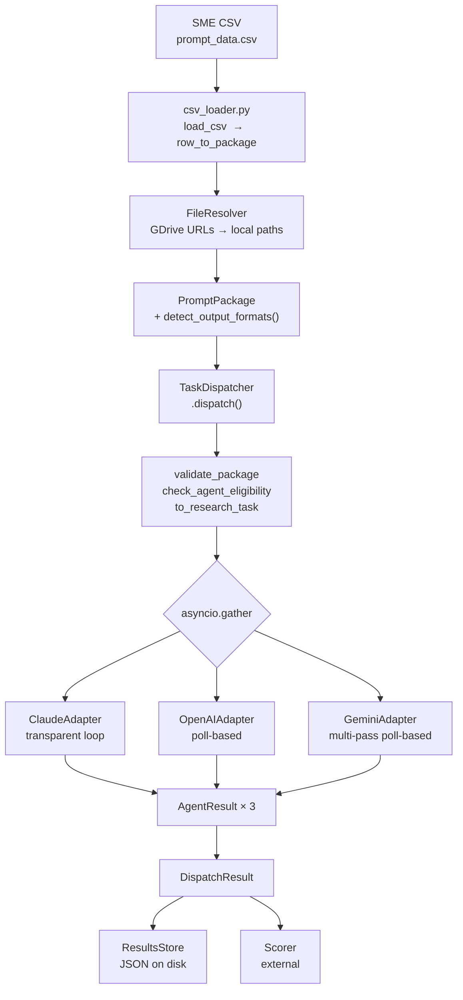
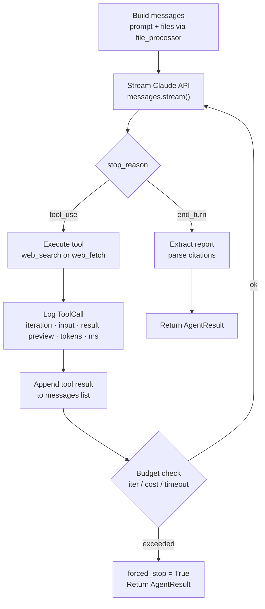
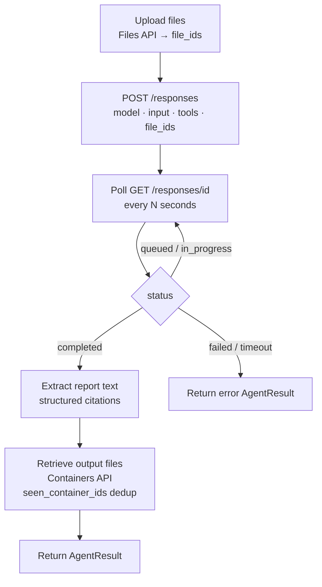
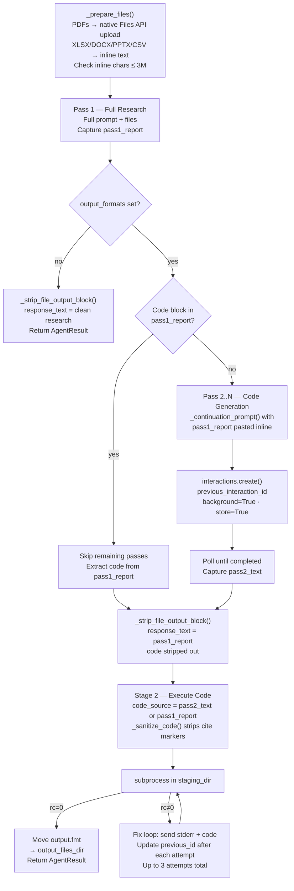
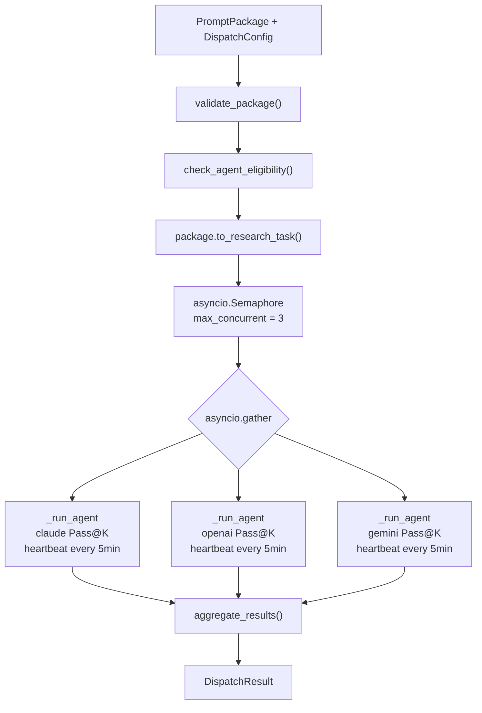
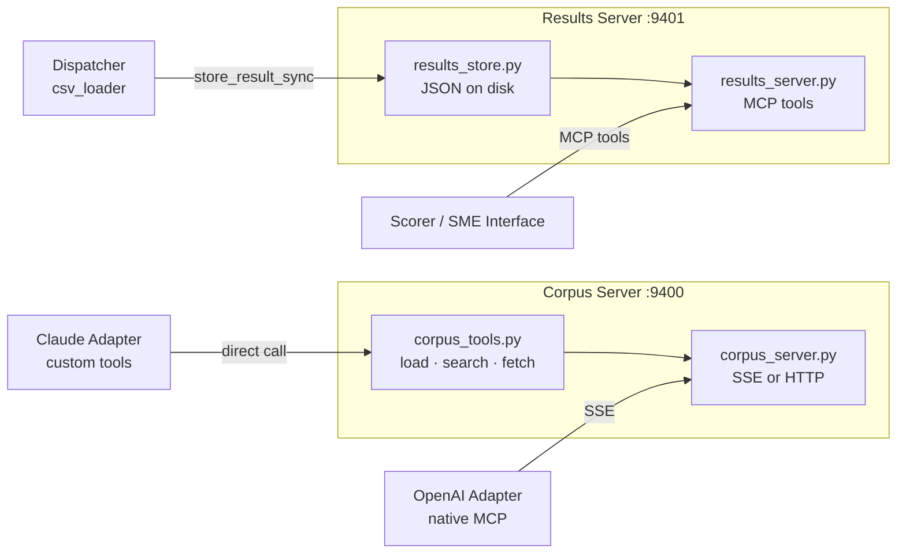
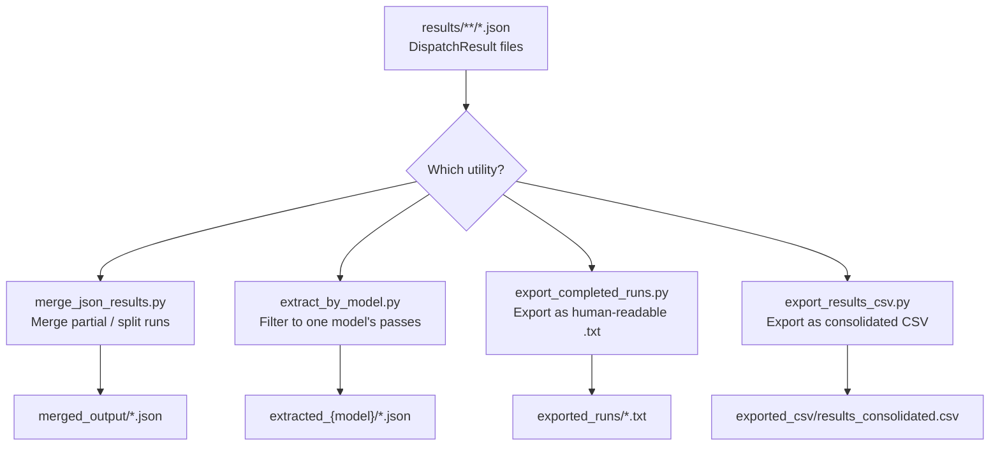

# DRA Benchmark Evaluation Framework

A multi-agent **Deep Research Agent (DRA)** evaluation framework for running, scoring, and quality-gating benchmark research tasks across three LLM agents.

---

## System Overview

Takes a benchmark prompt package authored by an SME, fans it out to all configured agent adapters concurrently, enforces IAT (Information Access Tier) constraints per agent, and collects structured `AgentResult` objects for downstream scoring.

---

## Architecture

```
deep_research_eval/
│
├── csv_loader.py              ← CLI: batch load SME CSV → dispatch to all agents
├── task_dispatcher.py         ← Core: concurrent fan-out to all three adapters
├── validate_adapters.py       ← CLI: dry-run validation of all three adapters
│
├── models.py                  ← Shared dataclasses (all inter-module contracts)
├── env_loader.py              ← .env loader (call at top of every entry point)
├── file_resolver.py           ← GDrive URL / file ID → local staging path
├── file_processor.py          ← Local file → Claude API content blocks
│
├── adapters/
│   ├── __init__.py            ← AGENT_REGISTRY + exports
│   ├── claude_adapter.py      ← Claude: transparent loop, streaming, full logging
│   ├── openai_adapter.py      ← OpenAI Responses API: Files API, Containers API
│   └── gemini_adapter.py      ← Gemini Interactions API: native PDF upload, multi-pass
│
├── file_generators/
│   ├── __init__.py            ← Exposes detect_output_formats()
│   └── detector.py            ← Regex-based xlsx / docx / pptx output detection
│
├── mcp_servers/
│   ├── corpus_server.py       ← MCP server: Tier 2 corpus file access (port 9400)
│   ├── corpus_tools.py        ← Corpus loading, keyword search, fetch logic
│   ├── results_server.py      ← MCP server: results collection + queries (port 9401)
│   └── results_store.py       ← File-based JSON storage backend for results
│
├── merge_json_results.py      ← Utility: merge split / partial result JSON files
├── extract_by_model.py        ← Utility: filter result files to one model's passes
├── export_completed_runs.py   ← Utility: export qualifying passes as readable .txt
├── export_results_csv.py      ← Utility: export all passes as consolidated CSV
│
└── test_gemini_stage2.py      ← Dev tool: validate Gemini file generation mechanism
```

### Main Pipeline Data Flow



---

## Key Concepts

### Prompt Structure Types (PSTs)

| Code | Full Name | IAT | Description |
|------|-----------|-----|-------------|
| `CRP` | Constrained Research Prompt | IAT-2 | Multi-constraint prompts requiring structured synthesis |
| `RCP` | Relevance Compression Prompt | IAT-1 | Extract key signal from high-noise, closed-corpus data |
| `SCP` | Structural Compliance Prompt | IAT-3 | Output must match a mandatory format; penalties for deviation |
| `LDP` | Latent Decomposition Prompt | IAT-1 | Surface non-obvious findings buried in closed-corpus files |
| `FSP` | Failure-Sensitive Prompt | IAT-3 | Deliberately trips lazy AI; requires live external data + file output |

### Information Access Tiers (IAT)

IAT determines whether an agent may use web search. Each PST maps to a fixed IAT, enforced via `ResearchTask.web_search_enabled`:

| IAT | Label | Web Search | PST |
|-----|-------|------------|-----|
| `IAT-1` | Closed Corpus | **Disabled** | RCP, LDP |
| `IAT-2` | Semi-Open | **Limited** | CRP |
| `IAT-3` | Open | **Required** | FSP, SCP |

**IAT-1 enforcement:** IAT-1 is enforced by setting `task.web_search_enabled = False`, which causes adapters to omit the web search tool. This is only a hard guarantee for Claude — Gemini and OpenAI o3 have confirmed or ambiguous web search leakage via model internals regardless of tool configuration. Their IAT-1 results carry a structural caveat in the dispatch log and should be treated as advisory.

**`enforce_iat` flag:** By default (`config.enforce_iat = False`), web search is always enabled for all agents regardless of IAT type. This allows collecting responses across all tasks without enforcing closed-corpus constraints. Set `enforce_iat = True` for benchmark-valid closed-corpus runs.

### Corpus Access Tiers

| Tier | Method | When Used |
|------|--------|-----------|
| **Tier 1** | Files injected directly into agent context (inline or via Files API) | Corpora ≤ 3 MB; default for all agents |
| **Tier 2** | MCP corpus server — agent fetches files on demand via `list_documents → search → fetch` | Corpora > 3 MB; avoids token inflation from native file upload |

When `DispatchConfig.mcp_server_url` is set, the dispatcher passes the corpus server URL to adapters that support MCP (Claude, OpenAI).

---

## Agent Adapters

### Claude (`claude_adapter.py`) — Transparent Loop

The only adapter where the full agent loop is visible. Every tool call, search query, and page fetch flows through the code and is logged in full detail. Uses the streaming API (`messages.stream()`) to support the extended inference times needed for deep research tasks.



- **IAT-1:** `web_search` tool omitted from the tools list entirely — the only adapter with hard IAT-1 enforcement
- **File output (`output_formats` set):** Files generated natively in the Claude sandbox via the Files API beta (`files-api-2025-04-14`); retrieved and written to `output_files_dir`
- **Observability:** HIGH — full `ToolCall` log per iteration
- **Cost:** O(N²) in iterations — context accumulates each round-trip

| Model | Input | Output |
|-------|-------|--------|
| `claude-opus-4-6` | $5.00 / MTok | $25.00 / MTok |
| `claude-sonnet-4-6` | $3.00 / MTok | $15.00 / MTok |

---

### OpenAI (`openai_adapter.py`) — Poll-Based Black Box

Uses the Responses API (not Chat Completions). The internal agent loop is fully opaque. File output for tasks that require it uses the Containers API — files generated by o3's code interpreter are retrieved after completion.



- **IAT-1:** `web_search_preview` tool omitted from the tools list; leakage remains possible via model internals — treat IAT-1 results as advisory
- **MCP:** Native support — pass `mcp_server_url` for Tier 2 corpus access
- **File output (`output_formats` set):** Output files retrieved from the Containers API after the response completes; written as binary to `output_files_dir`. Each container is listed only once regardless of how many `code_interpreter_call` blocks reference it.
- **Observability:** LOW — report text, token counts, structured `[{url, title}]` citations; no individual tool logs
- **Cost note:** Token estimate excludes per-query search charges (actual cost may be 20–50% higher)

| Model | Input | Output |
|-------|-------|--------|
| `o3-deep-research` | $10.00 / MTok | $40.00 / MTok |

---

### Gemini (`gemini_adapter.py`) — Multi-Pass Poll-Based

Uses the Gemini Interactions API with `agent='deep-research-pro-preview-12-2025'`. PDFs are uploaded natively via the Gemini Files API; all other file types (XLSX, DOCX, PPTX, CSV) are converted to inline text and embedded in the prompt.



- **IAT-1:** `google_search` tool excluded from the interaction config; leakage remains possible via model internals — treat IAT-1 results as advisory
- **File handling:** PDFs are uploaded via `client.files.upload()` and referenced as native document parts. XLSX, DOCX, PPTX, and CSV are converted to inline text. The total size of inline text content must not exceed 3M characters (~750K tokens) — if it does, the adapter raises a `ValueError` before making any API call. PDFs are not subject to this limit.
- **Smart PDF filtering:** For PDFs estimated to exceed 400K characters, `_pdf_smart_extract()` drops non-analytical statutory sections (corporate governance, CSR reports, secretarial audit boilerplate) while keeping financially relevant content (MD&A, balance sheets, notes to accounts). Keyword-based and page-range aware — no hardcoded page numbers.
- **Multi-pass research:** Stage 1 runs up to `max_research_passes` iterations (default: 4). Pass 1 always runs the full research. For text-only tasks (`output_formats` not set), exactly 1 pass runs. For file output tasks, subsequent passes are dedicated code generation passes — but only if Pass 1 did not already produce a code block inline. When a code block is found in Pass 1, all remaining passes are skipped. Each code generation pass receives `pass1_report` pasted directly into the continuation prompt so Gemini writes code from its actual research findings. Note: `previous_interaction_id` chains interactions but does NOT reliably carry research context across them — context is always passed explicitly as text. Token counts and costs are accumulated across all passes.
- **`response_text` guarantee:** `result.response_text` is always set from Pass 1's research output. `_strip_file_output_block()` removes any code block Gemini included inline before saving, so `response_text` always contains only the research report — never code.
- **File output (`output_formats` set):** Code is extracted from whichever pass produced it (Pass 1 inline or a dedicated code generation pass), sanitized via `_sanitize_code()` to remove citation markers, and executed locally. On failure, the stderr and broken code are sent back to Gemini requesting a fix. Each fix attempt chains off the previous fix interaction (`previous_interaction_id` updated after each attempt) so Gemini has cumulative context about what failed. Up to 3 fix attempts. Fix costs are accumulated into `result.total_cost_usd`.
- **Citation sanitization:** Gemini embeds `[cite: N]` markers inside generated code blocks causing `SyntaxError`. Three regex patterns remove these before execution.
- **Observability:** LOW — report text, token counts via `interaction.usage`, citations parsed from report text
- **MCP:** Not supported via the Interactions API

| Model | Input | Output | Cached Input |
|-------|-------|--------|--------------|
| `deep-research-pro-preview-12-2025` | $2.00 / MTok | $12.00 / MTok | $0.50 / MTok |

#### Gemini File Output — How It Works

For tasks that require a file output (detected by `detect_output_formats()` from the prompt text — any prompt type can require file output), the Gemini DRA cannot directly create files. The adapter orchestrates this in two stages:

**Stage 1 — Research and code generation:**

1. Pass 1 submits the full research prompt. The prompt includes a FILE GENERATION REQUIREMENT section instructing Gemini to append a sentinel-wrapped Python code block at the end of its report
2. If Pass 1 includes a code block (marked with `# GEMINI_FILE_OUTPUT_START` / `# GEMINI_FILE_OUTPUT_END`), subsequent passes are skipped
3. If Pass 1 has no code block, a dedicated code generation pass runs with the full Pass 1 research pasted directly into the continuation prompt — Gemini writes code from its actual findings, not from a blank context
4. `_strip_file_output_block()` removes the code block from `pass1_report` before saving it as `result.response_text`

**Stage 2 — Local execution with self-correction:**

5. `_extract_marked_code_block()` finds the sentinel-delimited block (falls back to library-hint fence regex if sentinels missing)
6. `_sanitize_code()` strips citation markers (`[cite: N]`) that cause `SyntaxError`
7. The code is executed locally via `subprocess` with `cwd=staging_dir` where input files are on disk. The code must save its output as `output.{fmt}` in the current directory
8. On failure, the stderr and broken code are sent to Gemini requesting a fix. `previous_interaction_id` is updated to the fix interaction's ID after each attempt, giving Gemini cumulative context about what went wrong. Up to 3 fix attempts
9. On success, `output.{fmt}` is moved to `output_files_dir` and recorded in `AgentResult`

The staging script is preserved on failure for manual debugging.

---

## Agent Adapter Comparison

| Dimension | Claude | OpenAI (o3) | Gemini |
|-----------|--------|-------------|--------|
| **API** | Anthropic Messages API (streaming) | OpenAI Responses API (poll) | Gemini Interactions API (multi-pass poll) |
| **Execution model** | Transparent loop — every tool call visible | Black box — opaque | Black box — opaque |
| **Input files: method** | Native Files API (PDF native, others as text) | Files API upload → `file_ids` | PDFs native via Files API; XLSX/DOCX/PPTX/CSV as inline text |
| **Input files: size limit** | 5 MB / file · 50 MB total · 10 files max | Files API limits; no adapter cap | Inline text ≤ 3M chars; PDFs have no limit |
| **IAT-1 enforcement** | ✅ Hard — `web_search` tool omitted | ⚠️ Soft — model internals may leak | ⚠️ Soft — model internals may leak |
| **Polling** | N/A — streaming | `GET /responses/{id}` every N seconds | `interactions.get({id})` every 10 seconds |
| **Multi-pass research** | N/A | N/A | Up to `max_research_passes` (default: 4); 1 pass for text-only tasks |
| **Pass skip optimization** | N/A | N/A | Remaining passes skipped if Pass 1 already has a code block |
| **Stale / timeout guard** | Budget limits | Dispatcher-level timeout | `StaleInteractionError` after 30 min |
| **Token / usage source** | `response.usage` per chunk | `response.usage` on completion | `interaction.usage` accumulated across all passes |
| **response_text source** | Final text output | Final text output | Always Pass 1 research (`pass1_report`), code stripped |
| **File output: code author** | Claude (in sandbox) | o3 (in container) | Gemini DRA (embedded in report) |
| **File output: execution** | Anthropic cloud sandbox | OpenAI Containers API | Local subprocess (`staging_dir`) |
| **File output: Stage 2 API calls** | No | No | Yes — up to 3 fix calls, each chains off previous fix |
| **File output: research context for code** | N/A | N/A | `pass1_report` pasted explicitly; `previous_interaction_id` alone is insufficient |
| **Citation marker sanitization** | N/A | N/A | `_sanitize_code()` strips `[cite: N]` before execution |
| **MCP support** | Yes | Yes — native SSE | No |
| **Context window** | 200K tokens | 200K tokens (o3) | 1M tokens |
| **Benchmark model** | `claude-opus-4-6` | `o3-deep-research` | `deep-research-pro-preview-12-2025` |
| **Cost (input / output)** | $5.00 / $25.00 per MTok (Opus) | $10.00 / $40.00 per MTok | $2.00 / $12.00 per MTok ($0.50 cached) |

---

## Installation

### Prerequisites

- Python 3.10+
- conda environment (tested on `dra` env on Mac, `adobe` env on DGX Spark)

### 1. Clone the repository

```bash
git clone git@github.com:tanm-ast-deccan/deep_research_agent.git
cd deep_research_agent/deep_research_eval
```

### 2. Create and activate conda environment

```bash
conda create -n dra python=3.10 -y
conda activate dra
```

### 3. Install all dependencies

```bash
# ── Core agent SDKs ────────────────────────────────────────────────
pip install anthropic openai google-genai python-dotenv

# ── File extraction — corpus ingestion ────────────────────────────
pip install python-docx openpyxl python-pptx PyMuPDF pdfminer.six

# ── GDrive corpus file resolution ─────────────────────────────────
pip install google-api-python-client google-auth google-auth-oauthlib

# ── MCP servers (corpus + results) ────────────────────────────────
pip install starlette uvicorn sse-starlette

# ── Data processing (used in Gemini-generated file output code) ───
pip install pandas numpy scipy matplotlib

# ── Optimisation (used in Gemini-generated pptx/xlsx output code) ─
pip install pulp scikit-learn

# ── Optional: improved PDF extraction for corpus_tools ────────────
pip install pdfplumber

# ── Optional: Excel Binary Workbook support (.xlsb corpus files) ──
pip install pyxlsb
```

> **Note:** The Gemini adapter requires `google-genai >= 1.55.0`. The legacy `google-generativeai` package is not compatible with the Interactions API.

### 4. Verify installation

```bash
python -c "
import anthropic, openai, google.genai
import docx, openpyxl, pptx, fitz
import pandas, numpy, scipy, matplotlib
import pulp, sklearn
import starlette, uvicorn
print('All dependencies OK')
"
```

### `requirements.txt`

```
# Agent SDKs
anthropic>=0.49.0
openai>=1.68.0
google-genai>=1.55.0
python-dotenv>=1.0.0

# File extraction
python-docx>=1.1.2
openpyxl>=3.1.5
python-pptx>=1.0.2
PyMuPDF>=1.24.0
pdfminer.six>=20221105

# GDrive
google-api-python-client>=2.100.0
google-auth>=2.23.0
google-auth-oauthlib>=1.1.0

# MCP servers
starlette>=0.41.0
uvicorn>=0.32.0
sse-starlette>=2.1.0

# Data processing (Gemini file output execution env)
pandas>=2.2.0
numpy>=1.26.0
scipy>=1.13.0
matplotlib>=3.9.0

# Optimisation (Gemini file output execution env)
pulp>=2.8.0
scikit-learn>=1.5.0

# Optional
pdfplumber>=0.11.0
pyxlsb>=1.0.10
```

---

## Environment Setup

Copy `.env.example` to `.env` and fill in your keys:

```bash
cp .env.example .env
```

```env
# ─── Agent API Keys ────────────────────────────────────────────────
ANTHROPIC_API_KEY=sk-ant-...
OPENAI_API_KEY=sk-...
GOOGLE_API_KEY=...

# ─── Google Drive Access ───────────────────────────────────────────
# Option A: Service account (server/automated use)
GOOGLE_SERVICE_ACCOUNT_KEY=/path/to/service-account.json
# Option B: OAuth (interactive/personal use)
# GOOGLE_CLIENT_SECRETS=/path/to/client_secrets.json

# ─── Optional Defaults ────────────────────────────────────────────
# DRA_DEFAULT_MODEL=claude-opus-4-6
# DRA_MAX_COST_USD=15.0
# DRA_TIMEOUT_SECONDS=900
# DRA_RESULTS_DIR=./results
# DRA_STAGING_DIR=./staging
```

`env_loader.py` is called at the top of every entry point and is safe to invoke multiple times. It searches for `.env` in the current working directory first, then in the script's directory.

---

## Usage

### `task_dispatcher.py` — Multi-agent dispatcher



Agents run concurrently; passes within an agent run sequentially. Each agent gets its own timeout (Claude: 15 min, OpenAI/Gemini: 60 min). A heartbeat log fires every 5 minutes for any agent still running.

```bash
python task_dispatcher.py \
    --prompt "Assess the risk in the attached term sheet" \
    --files term_sheet.pdf financials.xlsx \
    --research-type FSP --iat-type IAT-3 --domain "Financial Modeling" \
    --agents claude openai --live --output results/dispatch_001.json
```

**Flags:**

| Flag | Default | Description |
|------|---------|-------------|
| `--prompt` / `-p` | required | Research question |
| `--files` / `-f` | `[]` | File paths |
| `--research-type` | `""` | `CRP \| RCP \| SCP \| LDP \| FSP` |
| `--iat-type` | `""` | `IAT-1 \| IAT-2 \| IAT-3` |
| `--domain` | `""` | Management consulting domain (free text) |
| `--agents` | all three | Subset of agents to run |
| `--passes` | `1` | Pass@K — runs per agent |
| `--dry-run` | `True` | Simulate without API calls (default) |
| `--live` | off | Make real API calls |
| `--output` / `-o` | none | Save `DispatchResult` JSON |
| `--output-files-dir` | none | Base directory for generated output files (xlsx/docx/pptx) |
| `--verbose` / `-v` | off | Debug logging |

---

### `csv_loader.py` — Batch CSV dispatcher

The primary production entry point. Reads the standard `prompt_data.csv` from the SME intake form, converts each row to a `PromptPackage`, automatically detects required output formats, optionally resolves GDrive file links, and dispatches through the full evaluation pipeline.

```bash
python csv_loader.py \
    --csv prompt_data.csv \
    --resolve-files --staging-dir /tmp/eval_files \
    --dispatch --live \
    --agents claude openai gemini \
    --results-dir /data/eval_results \
    --output dispatch_results/

# Filter to specific task IDs
python csv_loader.py \
    --csv prompt_data.csv --dispatch --live \
    --task-ids tsk_001,tsk_002 --agents gemini
```

**Flags:**

| Flag | Default | Description |
|------|---------|-------------|
| `--csv` | required | Path to `prompt_data.csv` |
| `--preview` | off | Print stats + sample packages; no dispatch |
| `--dispatch` | off | Fan tasks out to agents |
| `--resolve-files` | off | Download GDrive files to local staging |
| `--staging-dir` | none | Directory for downloaded GDrive files |
| `--agents` | all three | Subset of agents |
| `--passes` | `1` | Pass@K per agent |
| `--dry-run` | `True` | Default; simulate without API calls |
| `--live` | off | Make real API calls |
| `--results-dir` | none | Persist results via `ResultsStore` |
| `--output` / `-o` | none | Save per-task JSON files to directory |
| `--task-ids` | none | Comma-separated task IDs (e.g. `tsk_abc,tsk_def`) |
| `--filter-type` | none | Only process this PST |
| `--filter-sme` | none | Only process prompts from this SME (substring match) |
| `--max-rows` | none | Cap at N rows (applied before GDrive downloads) |
| `--timeout` | none | Per-task timeout in seconds (overrides model default) |
| `--verbose` / `-v` | off | Debug logging |

---

### `validate_adapters.py` — Adapter dry-run validator

```bash
cd deep_research_eval
python validate_adapters.py
```

Runs test tasks through all three adapters in dry-run mode. Exits `0` if all tests pass, `1` otherwise.

---

## CSV Column Format

| CSV Column | Maps To | Notes |
|------------|---------|-------|
| `Prompt ID` | `task_id` | Auto-generated if blank; Excel float IDs like `28115.0B` are normalized |
| `POC Name` | `sme_name` | SME metadata, not sent to agents |
| `Date` | `submitted_at` | Metadata only |
| `Category` | `research_type` | One of: `CRP \| RCP \| SCP \| LDP \| FSP` |
| `Domain` | `domain` | Management consulting sub-domain |
| `Prompts` | `prompt` | The actual research question. Rows without this are skipped |
| `Logic` | `solution_steps` | Solution logic, split on newlines into steps |
| `SC` | `lazy_ai_prediction` | Sanity check — how a lazy AI would fail |
| `Drive` | `file_paths` | GDrive folder/file URL, resolved to local paths if `--resolve-files` |

---

## File Handling

### `file_generators/` — Output Format Detection

Called automatically by `csv_loader.py` and `task_dispatcher.py` for every prompt.

```python
from file_generators import detect_output_formats

detect_output_formats("Present the final results in Excel format.")  # → ['xlsx']
detect_output_formats("Produce a Word document deliverable.")        # → ['docx']
detect_output_formats("Use Data Dump 1.xlsx to extract the data.")   # → []
```

### `file_resolver.py` — GDrive → Local Path

| Input format | Handling |
|---|---|
| `/local/path/file.pdf` | Pass through |
| `https://drive.google.com/file/d/{ID}/view` | Download single file |
| `https://drive.google.com/drive/folders/{ID}` | Download entire folder |
| `https://docs.google.com/spreadsheets/d/{ID}` | Export as `.xlsx` |
| `https://docs.google.com/document/d/{ID}` | Export as `.pdf` |

### Gemini File Handling

- **PDFs** — uploaded via `client.files.upload()` as native document parts. For PDFs estimated to exceed 400K characters, `_pdf_smart_extract()` drops statutory boilerplate while keeping financially relevant content.
- **XLSX** — converted to labelled TSV via `_xlsx_to_text()`. LibreOffice headless pre-evaluates formulas so formula-only cells return computed values rather than `None`.
- **DOCX** — extracted via python-docx, preserving paragraph structure and table content.
- **PPTX** — extracted slide-by-slide via python-pptx.
- **CSV, TXT, JSON** — read directly as UTF-8.

Total inline text content (all non-PDF files combined) must not exceed 3M characters (~750K tokens). If it does, the adapter raises a `ValueError` before any API call.

---

## MCP Servers



### `corpus_server.py` — Tier 2 Corpus Server (port 9400)

```bash
python mcp_servers/corpus_server.py --corpus-dir /path/to/files --port 9400
```

| Tool | Description |
|------|-------------|
| `list_documents` | Enumerate corpus files with metadata |
| `search` | Keyword search; returns ranked snippets |
| `fetch` | Retrieve full extracted text of a document |

### `results_server.py` — Results Collection Server (port 9401)

```bash
python mcp_servers/results_server.py --results-dir /path/to/results --port 9401
```

| Tool | Description |
|------|-------------|
| `store_result` | Save a `DispatchResult` |
| `store_scores` | Attach evaluation scores to an existing result |
| `get_result` | Retrieve full `DispatchResult` by task ID |
| `get_scores` | Retrieve evaluation scores by task ID |
| `list_results` | List all results with lightweight metadata |
| `query_results` | Filtered search by `research_type`, `iat_type`, `domain`, `agent` |
| `get_comparison` | Side-by-side agent comparison for a task |
| `get_stats` | Aggregate statistics across all results |

### `results_store.py` — Storage Backend

```
results_dir/
├── index.json
├── tasks/
│   └── TASK-001.json        ← full DispatchResult
└── scores/
    └── TASK-001_scores.json ← evaluation scores
```

On rerun, `store_result()` merges the new result with the existing one. Agent results are merged by agent name (new run wins per agent). `total_cost_usd` is summed. `package` and `config` fields are merged at the key level — only non-None values from the new run overwrite existing values.

---

## Post-Processing Utilities



### `merge_json_results.py`

```bash
python merge_json_results.py \
    --source-dirs ./results/json ./results_partial/json \
    --output-dir ./merged_output/json
```

### `extract_by_model.py`

```bash
python extract_by_model.py --model claude-opus-4-6 --input results.json
python extract_by_model.py --model claude --match contains \
    --input-dir ./results/tasks --output-dir ./extracted/claude
```

### `export_completed_runs.py`

Filters to qualifying passes (`completed=true`, `forced_stop=false`, `dry_run=false`) and writes each as a formatted `.txt` report.

```bash
python export_completed_runs.py --input-dir ./results/tasks --output-dir ./reports
```

### `export_results_csv.py`

One row per agent pass. Includes both PASS and FAIL rows by default.

```bash
python export_results_csv.py --input-dir ./results/tasks --output-dir ./reports --summary
```

> Point `--input-dir` to `./results/<run>/tasks/`, not to `./results/<run>/`.

---

## Output Files

### `AgentResult` (per-agent, per-pass)

| Field | Description |
|-------|-------------|
| `task_id` | Task identifier |
| `agent` | `claude \| openai \| gemini` |
| `model` | Exact model string used |
| `response_text` | Final research report (Markdown). For Gemini: always Pass 1 research with code stripped. |
| `citations` | `[{url, title, snippet}]` |
| `tool_call_log` | Full `ToolCall` log — **Claude only** |
| `output_files` | Absolute local paths to generated output files |
| `output_file_errors` | `{format: error_message}` for formats requested but not produced |
| `input_tokens` / `output_tokens` | Token counts (Gemini: accumulated across all passes and fix calls) |
| `total_cost_usd` | Calculated cost (Gemini: includes all pass and fix call costs) |
| `total_duration_sec` | Wall-clock time |
| `completed` | Whether agent finished without forced stop |
| `forced_stop` | True if budget / iteration / timeout limit was hit |
| `error` | Error message if any |
| `started_at` / `completed_at` | ISO timestamps |

### `DispatchResult` (per-task, all agents)

- The original `PromptPackage` (prompt, PST, IAT, domain, file names, `output_formats`)
- `DispatchConfig` (agents, passes, dry_run, mcp_server_url, `output_files_base_dir`)
- `agent_results`: `{agent_name: [AgentResult, ...]}`
- `agents_attempted`, `agents_succeeded`, `agents_failed`, `agent_errors`
- `total_cost_usd`, `total_duration_sec`, `dispatched_at`, `completed_at`

---

## Data Models

| Class | Created By | Consumed By |
|-------|------------|-------------|
| `PromptPackage` | `csv_loader.py` | `TaskDispatcher` |
| `ResearchTask` | `PromptPackage.to_research_task()` | Agent adapters |
| `ToolCall` | Agent adapters | `AgentResult` |
| `AgentResult` | Agent adapters | `DispatchResult`, scorer |
| `DispatchConfig` | CLI / caller | `TaskDispatcher` |
| `DispatchResult` | `TaskDispatcher` | `ResultsStore`, scorer |

---

## Troubleshooting

**`PackageValidationError: prompt is required (minimum 20 characters)`**
The CSV row has an empty or very short `Prompts` column.

**IAT-1 web search leakage (Gemini / OpenAI)**
Expected structural limitation. Only Claude provides hard IAT-1 enforcement. Treat Gemini and OpenAI IAT-1 results as advisory.

**Gemini inline corpus too large**
If total inline file content (XLSX, DOCX, PPTX, CSV — not PDFs) exceeds 3M characters, the adapter raises a `ValueError` before any API call. PDFs are not subject to this limit. Fix: reduce XLSX/DOCX/PPTX file sizes or split the task.

**`StaleInteractionError` from Gemini adapter**
The Gemini interaction stopped progressing for 30 minutes. Check the Gemini API status page or retry the task.

**Gemini file output code execution failure**
The adapter automatically sends the stderr and broken code back to Gemini requesting a fix. Each fix attempt chains off the previous fix interaction so Gemini has cumulative context about what failed. Up to 3 fix attempts. If all fail, the final stderr is captured in `AgentResult.error`. The staging script is preserved on failure at `{staging_dir}/_gemini_gen_{task_id}.py` — inspect and run it manually to reproduce the error.

Common causes:
- **Missing library** — install and retry. All likely imports are in the Installation section.
- **Wrong column name** — Gemini infers column names from research data; actual headers may differ. Record as FAIL.
- **Wrong API usage** — model code quality failure. Record as FAIL.
- **File not found** — confirm files were downloaded with `--resolve-files --staging-dir`.

**Gemini response_text contains code**
Should not happen with the current adapter. `_strip_file_output_block()` removes sentinel-wrapped code blocks from `pass1_report` before saving. If seen, Gemini did not use the correct sentinel format (`# GEMINI_FILE_OUTPUT_START` / `# GEMINI_FILE_OUTPUT_END`) and stripping fell back to raw text.

**GDrive auth error**
Confirm `GOOGLE_SERVICE_ACCOUNT_KEY` points to a valid service account JSON with read access to the target folder.

**Corpus server not reachable by OpenAI adapter**
Ensure `corpus_server.py` is running in SSE mode (`--mode sse`, the default) and the URL matches.

**`ImportError` on `adapters` or `mcp_servers`**
Run all CLIs from the `deep_research_eval/` root.

**`export_results_csv.py` — 0 rows**
Point `--input-dir` to `./results/<run>/tasks/` not to `./results/<run>/`.

**`--resolve-files` must be passed explicitly**
Omitting it silently runs tasks without corpus files. Always include `--resolve-files --staging-dir /tmp/eval_files` for any live dispatch.

**OpenAI `invalid_prompt` 400 error**
OpenAI's content filter occasionally rejects dense financial prompts. Record as `failure_category = "Policy rejection — o3 content filter"` and exclude from o3's pass rate.

**Gemini interaction timeouts — API capacity issue**
If multiple tasks show `Timeout — interaction stuck` with `0 input_tokens`, the Gemini API did not pick up the interaction. Retry at a different time:

```bash
python csv_loader.py --csv ./input/your_batch.csv \
    --resolve-files --staging-dir /tmp/eval_files \
    --dispatch --live --agents gemini \
    --task-ids "tsk_abc,tsk_def,tsk_ghi" \
    --output ./results_rerun \
    --results-dir ./results_rerun
```

`--task-ids` accepts comma-separated task IDs (no spaces).